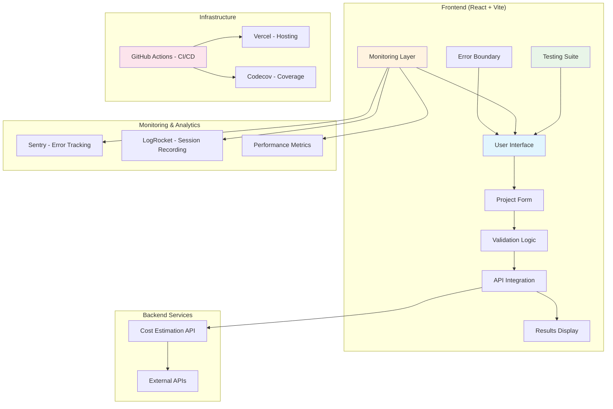

# Ghanabuild.AI - Advanced House Cost Estimator

A modern React-based web application for estimating construction costs in Ghana, featuring AI-powered calculations, real-time form validation, and comprehensive monitoring.

## 🏗️ System Architecture



## ✨ Features

### Core Functionality
- 📋 **Interactive Project Form** - Comprehensive project details input with real-time validation
- 🧮 **AI-Powered Cost Estimation** - Advanced algorithms for accurate construction cost calculation
- ⚡ **Real-time Validation** - Immediate feedback on form inputs with detailed error messages
- 📊 **Detailed Cost Breakdown** - Transparent breakdown of materials, labor, and additional costs
- 🔄 **Error Recovery** - Graceful error handling with retry mechanisms

### Technical Features
- 🧪 **Comprehensive Testing** - Unit and integration tests with 90%+ coverage
- 📊 **Performance Monitoring** - Real-time performance tracking and user analytics
- 🛡️ **Error Tracking** - Automated error reporting and debugging assistance
- 🎨 **Modern UI/UX** - Responsive design with Tailwind CSS and smooth animations
- 🔒 **Privacy-First** - Data sanitization and privacy controls for monitoring

## 🚀 Quick Start

### Prerequisites

- **Node.js** 20.x or higher
- **npm** 9.x or higher
- **Git**

### Installation

1. **Clone the repository**
   ```bash
   git clone https://github.com/Engineer233/ghanabuild-ui-v1.git
   cd ghanabuild-ui-v1
   ```

2. **Install dependencies**
   ```bash
   npm install
   ```

3. **Set up environment variables**
   ```bash
   cp .env.example .env
   ```
   
   Edit `.env` and configure the following:
   ```bash
   # API Configuration
   REACT_APP_API_URL=https://ghanabuild-backend.onrender.com
   
   # Monitoring (Optional - for production)
   REACT_APP_SENTRY_DSN=your_sentry_dsn_here
   REACT_APP_LOGROCKET_APP_ID=your_logrocket_app_id_here
   ```

4. **Start development server**
   ```bash
   npm run dev
   ```

5. **Open your browser**
   Navigate to [http://localhost:5173](http://localhost:5173)

## 🧪 Development

### Available Scripts

```bash
# Development
npm run dev          # Start development server
npm run build        # Build for production
npm run preview      # Preview production build

# Testing
npm run test         # Run tests in watch mode
npm run test:run     # Run tests once
npm run test:coverage # Run tests with coverage report

# Code Quality
npm run lint         # Check code style
npm run lint:fix     # Fix auto-fixable linting issues
```

### Project Structure

```
src/
├── components/           # React components
│   └── EstimatorForm.jsx
├── test/                # Test files
│   ├── components/      # Component tests
│   ├── api.test.js      # API tests
│   └── setup.js         # Test configuration
├── App.jsx              # Main application component
├── ErrorBoundary.jsx    # Error boundary component
├── api.js               # API integration logic
├── monitoring.js        # Monitoring and analytics
├── main.jsx            # Application entry point
└── index.css           # Global styles

.github/
├── workflows/          # CI/CD workflows
└── pull_request_template.md

docs/
├── MONITORING.md       # Monitoring setup guide
└── README.md          # This file
```

### Testing Strategy

The application includes comprehensive testing at multiple levels:

- **Unit Tests** - Individual component and function testing
- **Integration Tests** - API integration and form workflow testing
- **Error Boundary Tests** - Error handling and recovery testing
- **Performance Tests** - API response time and validation speed testing

Run tests with coverage:
```bash
npm run test:coverage
```

### Code Quality

The project enforces code quality through:

- **ESLint** - Code style and best practices
- **React Testing Library** - Component testing standards
- **Vitest** - Fast and reliable test runner
- **GitHub Actions** - Automated CI/CD pipeline

## 🚀 Deployment

### Vercel Deployment (Recommended)

The application is configured for seamless deployment on Vercel:

1. **Fork this repository**

2. **Connect to Vercel**
   - Import project in Vercel dashboard
   - Configure environment variables
   - Deploy automatically on push to main

3. **Configure Environment Variables in Vercel**
   ```bash
   REACT_APP_API_URL=your_production_api_url
   REACT_APP_SENTRY_DSN=your_sentry_dsn
   REACT_APP_LOGROCKET_APP_ID=your_logrocket_id
   ```

### Manual Deployment

```bash
# Build the application
npm run build

# Deploy the dist/ folder to your hosting service
```

## 📊 Monitoring Setup

### Sentry (Error Tracking)

1. Create account at [sentry.io](https://sentry.io)
2. Create a new React project
3. Add DSN to environment variables
4. Deploy - errors will be automatically tracked

### LogRocket (Session Recording)

1. Create account at [logrocket.com](https://logrocket.com)
2. Create a new app
3. Add App ID to environment variables
4. Deploy - user sessions will be recorded

For detailed monitoring setup, see [MONITORING.md](MONITORING.md).

## 🌍 Environment Variables

| Variable | Description | Required | Default |
|----------|-------------|----------|---------|
| `REACT_APP_API_URL` | Backend API endpoint | ✅ | - |
| `REACT_APP_SENTRY_DSN` | Sentry error tracking DSN | ❌ | - |
| `REACT_APP_LOGROCKET_APP_ID` | LogRocket session recording ID | ❌ | - |

## 🔧 Configuration

### Form Validation Rules

The application enforces the following validation rules:

- **Region**: Minimum 2 characters, letters/spaces/hyphens only
- **Total Floor Area**: Integer between 500-10,000 sq ft
- **Number of Bathrooms**: Integer between 1-10
- **Number of Floors**: Integer between 1-5
- **Project Type**: Residential or Commercial
- **Finish Quality**: Basic, Standard, or Premium

### API Integration

The application integrates with the Ghanabuild backend API:

- **Endpoint**: `/estimate`
- **Method**: POST
- **Timeout**: 15 seconds
- **Retry Logic**: Manual retry on errors
- **Response Format**: JSON with cost breakdown

## 🤝 Contributing

1. **Fork the repository**
2. **Create a feature branch** (`git checkout -b feature/amazing-feature`)
3. **Make your changes**
4. **Add tests** for new functionality
5. **Ensure all tests pass** (`npm run test:run`)
6. **Check code style** (`npm run lint`)
7. **Commit your changes** (`git commit -m 'Add amazing feature'`)
8. **Push to the branch** (`git push origin feature/amazing-feature`)
9. **Open a Pull Request**

### Pull Request Guidelines

- Use the provided PR template
- Ensure all CI checks pass
- Include test coverage for new features
- Update documentation if needed
- Follow the existing code style

## 📈 Performance

- **Lighthouse Score**: 95+ (Performance, Accessibility, Best Practices, SEO)
- **Bundle Size**: < 500KB gzipped
- **Core Web Vitals**: All green scores
- **Test Coverage**: 90%+ on core functionality

## 🛠️ Troubleshooting

### Common Issues

1. **Build Fails**
   - Ensure Node.js 20.x is installed
   - Clear node_modules and reinstall: `rm -rf node_modules package-lock.json && npm install`

2. **Tests Fail**
   - Check for missing environment variables
   - Ensure all dependencies are installed
   - Run tests in verbose mode: `npm run test:run -- --reporter=verbose`

3. **Monitoring Not Working**
   - Verify environment variables are set
   - Check that you're running in production mode
   - See [MONITORING.md](MONITORING.md) for detailed troubleshooting

### Getting Help

- 📚 Check the [documentation](docs/)
- 🐛 [Open an issue](https://github.com/Engineer233/ghanabuild-ui-v1/issues)
- 💬 [Start a discussion](https://github.com/Engineer233/ghanabuild-ui-v1/discussions)

## 📄 License

This project is licensed under the MIT License - see the [LICENSE](LICENSE) file for details.

## 🙏 Acknowledgments

- **React Team** - For the amazing React framework
- **Vite Team** - For the lightning-fast build tool
- **Tailwind CSS** - For the utility-first CSS framework
- **Testing Library** - For the excellent testing utilities
- **Sentry & LogRocket** - For comprehensive monitoring solutions

---

**Built with ❤️ for the Ghana construction industry**